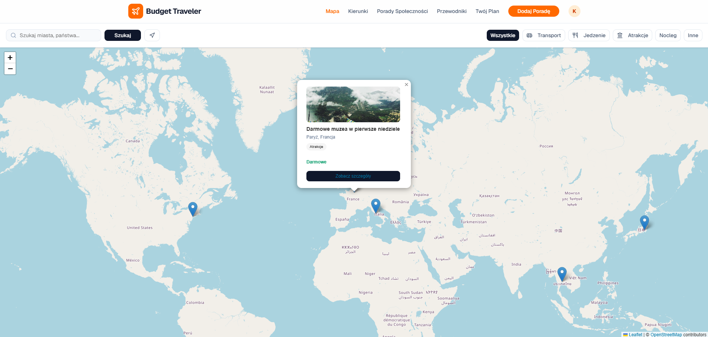
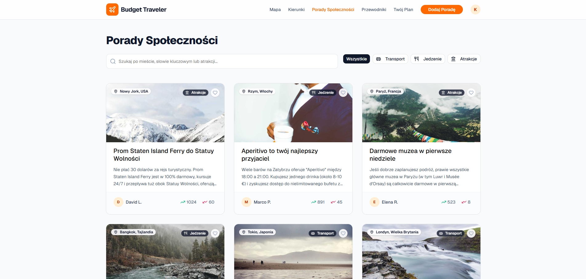
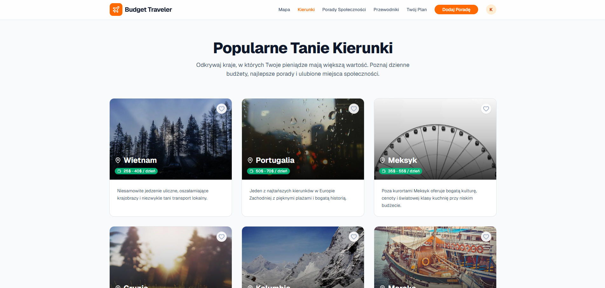
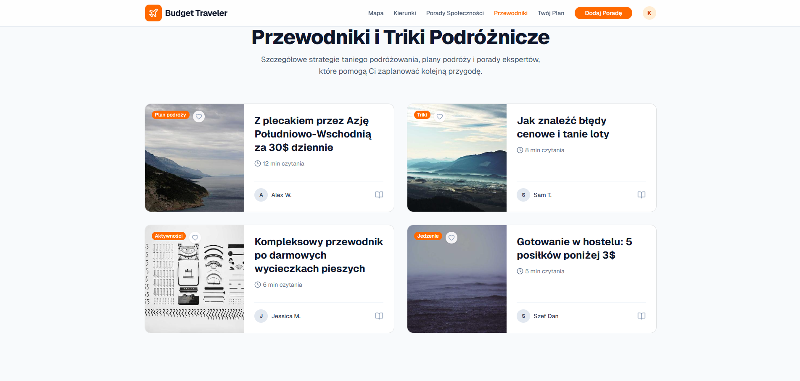
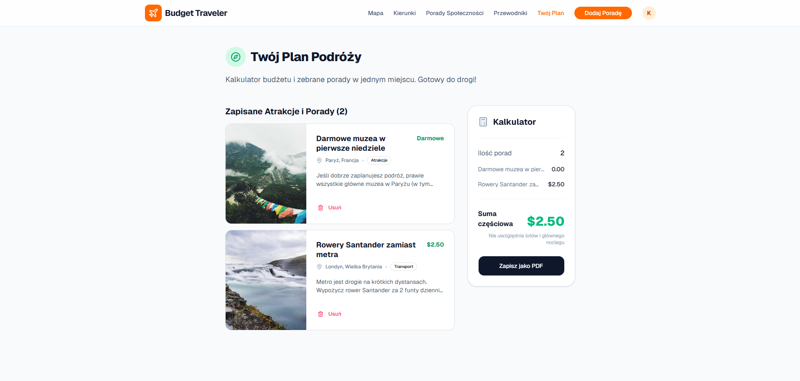
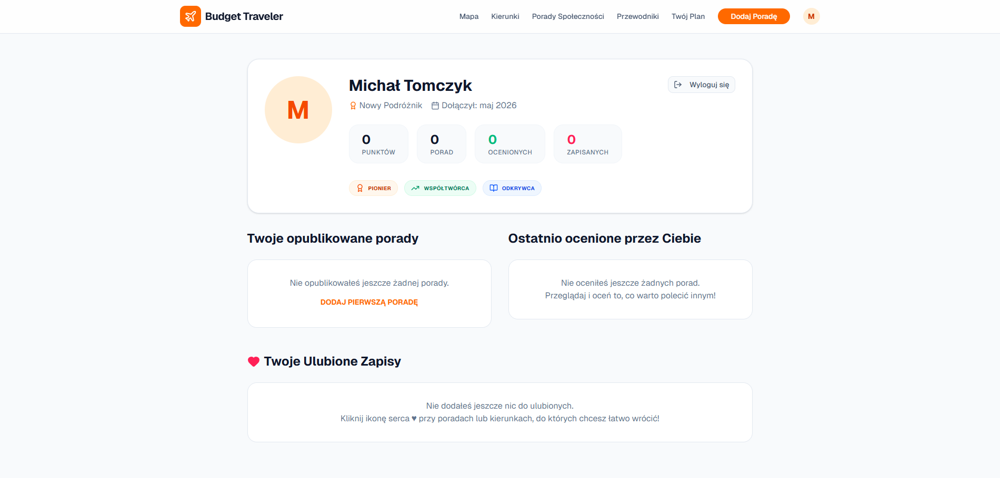
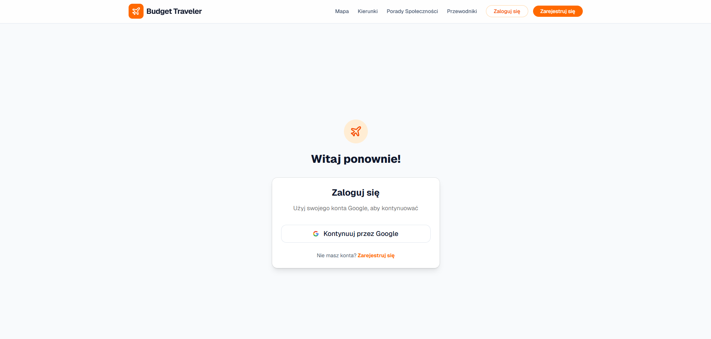
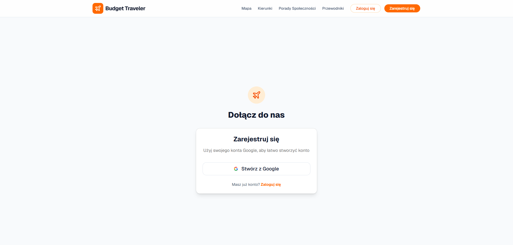

# Budget Traveler

Aplikacja webowa do planowania niskobudżetowych podróży, stworzona jako projekt zaliczeniowy z przedmiotu **Projektowanie Frontendowe**. Zamiast reklamowych materiałów — realne porady społeczności: gdzie tanio zjeść, jak dotrzeć, co zwiedzić.

---

## Spis treści

- [Technologie](#technologie)
- [Funkcjonalności](#funkcjonalności)
- [Screeny](#screeny)
- [Google Analytics](#google-analytics)
- [Hotjar](#hotjar)
- [Uruchomienie](#uruchomienie)
- [Struktura projektu](#struktura-projektu)

---

## Technologie

| Warstwa       | Technologia                      |
| ------------- | -------------------------------- |
| Framework     | React 19 + Vite 6                |
| Routing       | React Router DOM 7               |
| Stylowanie    | Tailwind CSS 4                   |
| Komponenty UI | shadcn/ui, Lucide React          |
| Animacje      | Motion (Framer Motion)           |
| Mapy          | Leaflet + React Leaflet          |
| Autentykacja  | Firebase Authentication (Google) |
| Baza danych   | Cloud Firestore                  |
| Analityka     | Google Analytics 4 (react-ga4)   |
| Analityka UX  | Hotjar / Contentsquare           |
| AI            | Google Gemini API                |
| Język         | TypeScript                       |

---

## Funkcjonalności

**Mapa interaktywna** — Leaflet z pinezkami porad, wyszukiwanie przez Nominatim, filtrowanie wg kategorii (Transport, Jedzenie, Atrakcje), geolokalizacja.

**Porady społecznościowe** — przeglądanie, filtrowanie i wyszukiwanie porad wg miasta i kategorii, głosowanie (upvote/downvote), dodawanie własnych porad ze zdjęciem i ceną.

**Destynacje budżetowe** — 6 krajów z szacowanym dziennym budżetem i szczegółowym opisem.

**Przewodniki** — artykuły podróżnicze z galerią zdjęć, czasem czytania i kategoryzacją.

**Planer wycieczki** — osobista lista zaplanowanych destynacji.

**Profil użytkownika** — logowanie przez Google, statystyki aktywności, zakładki z ulubionymi poradami, przewodnikami i destynacjami.

**Dodawanie porad** — formularz z walidacją, dostępny tylko dla zalogowanych użytkowników.

---

## Screeny

### Strona główna


### Mapa interaktywna



### Porady




### Destynacje



### Przewodniki



### Planer wycieczki



### Profil



### Dodawanie porady


### Logowanie i rejestracja





### Widok mobilny


---

## Google Analytics

Integracja z GA4 przez `react-ga4`. Każda zmiana strony jest rejestrowana automatycznie przez komponent `AnalyticsTracker.tsx`.


---

## Hotjar/Contentsquare

Analiza zachowań użytkowników (heatmapy, nagrania sesji) przez Hotjar / Contentsquare — skonfigurowane w `ContentsquareTracker.tsx`.


---

## Uruchomienie

Wymagania: Node.js ≥ 18, npm lub yarn.

```bash
git clone <url-repozytorium>
cd budget-traveler
npm install
cp .env.example .env   # uzupełnij klucze Firebase i GA
npm run dev
```

Aplikacja działa pod `http://localhost:3000`.

```bash
# build produkcyjny
npm run build
npm run preview
```

---

## Struktura projektu

```
budget-traveler/
├── src/
│   ├── pages/              # widoki aplikacji
│   │   ├── Home.tsx
│   │   ├── Destinations.tsx
│   │   ├── Tips.tsx
│   │   ├── TipDetail.tsx
│   │   ├── Guides.tsx
│   │   ├── MapPage.tsx
│   │   ├── Itinerary.tsx
│   │   ├── ShareTip.tsx
│   │   ├── Profile.tsx
│   │   ├── Login.tsx
│   │   └── Register.tsx
│   ├── components/
│   │   ├── Layout.tsx
│   │   ├── AnalyticsTracker.tsx
│   │   └── ContentsquareTracker.tsx
│   ├── context/
│   │   └── AppContext.tsx
│   ├── data/
│   │   └── mockData.tsx
│   ├── firebase.ts
│   └── App.tsx
├── components/ui/
├── public/
├── .env.example
├── vite.config.ts
└── package.json
```

---

## Autorzy

- Kamila Żur
- Karolina Minor
- Michał Tomczyk
